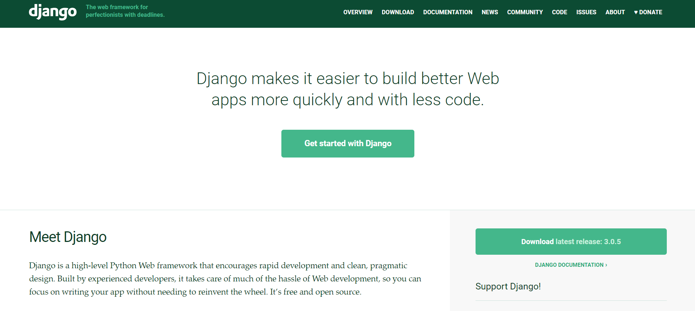
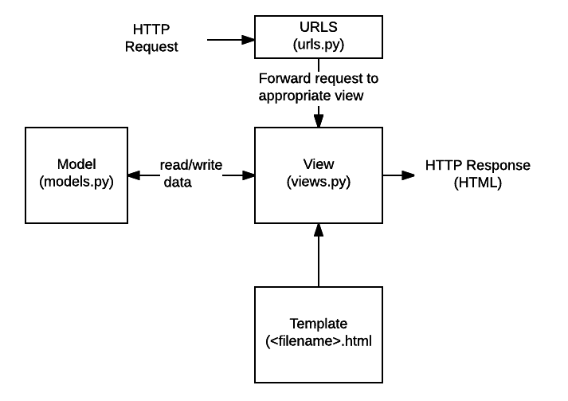

# :snake: DJango<!-- omit in toc -->

## Tabla de Contenido<!-- omit in toc -->
- [Introducción](#introducci%c3%b3n)
  - [Frameworks](#frameworks)
  - [DJango](#django)
- [Creación del proyecto](#creaci%c3%b3n-del-proyecto)
- [Request y URL Dispatcher](#request-y-url-dispatcher)
- [Debuguer](#debuguer)
- [Crear una aplicación](#crear-una-aplicaci%c3%b3n)
- [Patrones de diseño](#patrones-de-dise%c3%b1o)
  - [MVC Model View Controller](#mvc-model-view-controller)
  - [MTV Model Template View](#mtv-model-template-view)

# Introducción

Django es un framework de desarrollo web de código abierto, escrito en Python, que respeta el patrón de diseño conocido como MVC. 

  
  <small>Texto</small>

## Frameworks
Los frameworks existen para resolver los siguientes problemas proporcionando un marco de trabajo común

* HTTP
* Conexión a la base de datos
* Interacción HTML (templates)
* Agrega su propio sabor

## DJango

Objetivos
* Sitios grandes
* URLs bien diseñadas
* Wrapper para request y response
* Muchos sitios en poco tiempo
* Un ORM para la BD

Su popularidad se refiere a sus características

* Rápido desarrollo
* Listo para todo
* Seguro
* Escalable
* Versatil

Ventajas
* Python (curva baja) y zen de Python
* DRY (Dont Repeat Your Self)
* Comunidad
* Open Source

# Creación del proyecto

En un ambiente virtual
`pip freeze`
Instalamos Django
`pip install Django`
Al instalar tendremos disponible el comando Django Admin
`django-admin`

Para crear un proyecto
`django-admin startproject photogram .`

Al ejecutar creara una estructura base del proyecto con los siguientes archivos

* init.py. Declara el proyecto con un módulo de Python
* settings.py. Define las configuraciones del proyecto
* url.py. Punto de entrada para las peticiones del proyecto
* wsgi.py. Archivo usado durante el deployment a producción
* manage.py No se va a tocar, pero con este se interactuará en el desarrollo (interfaz django admin)

Para ejecutar el manage.py ofrece una serie de opciones como django-admin

`python manage.py`

Para correr el servidor ejecutar

`python manage.py runserver`

# Request y URL Dispatcher

https://docs.djangoproject.com/en/3.0/topics/http/urls/

# Debuguer 

Agrega está linea para debuguear algo en consola
`import pdb; pdb.set_trace()`

# Crear una aplicación

`python manage.py startapp posts`

# Patrones de diseño

Son una solución reutilizable a un problema común

## MVC Model View Controller

  
  <small>MVC</small>

## MTV Model Template View

  
  <small>MTV</small>

